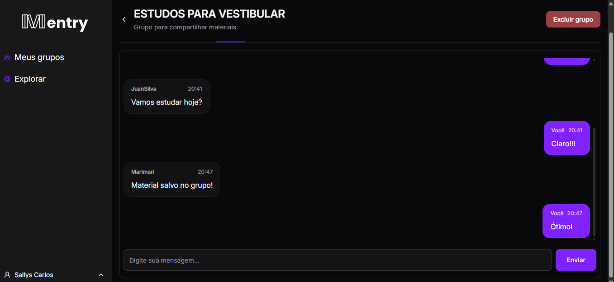
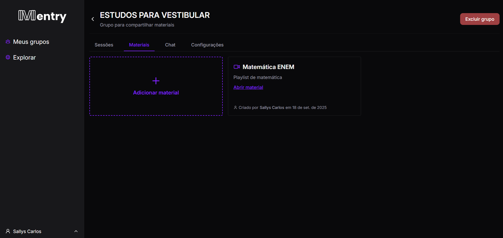
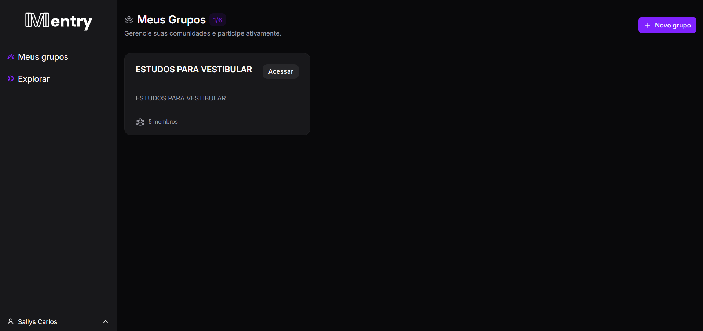

# 🎨 Mentry - Frontend  

  <a href="#-sobre">Sobre</a> • 
  <a href="#-demonstração">Demonstração</a> • 
  <a href="#-prints">Prints</a> • 
  <a href="#-tecnologias">Tecnologias</a>

  

---

## 📖 Sobre  

O **Mentry** é uma plataforma colaborativa voltada para **grupos de estudo**, desenvolvida para facilitar a organização, o aprendizado coletivo e a troca de conhecimento entre estudantes.  

Na plataforma, os usuários podem:  
- Criar **sessões de estudo** com horário definido, ajudando na disciplina e organização;  
- Compartilhar **materiais de apoio** dentro do grupo;  
- Utilizar um **chat interno** em tempo real, permitindo discussão, dúvidas e colaboração durante e fora das sessões de estudo;  
- Acompanhar a **história de cada grupo**, com registros de sessões passadas e materiais compartilhados;  
- Organizar grupos temáticos (ex.: vestibular, concursos, faculdade) e engajar de acordo com interesses em comum.    

👉 Veja também o repositório do **[Mentry - Backend](https://github.com/seu-usuario/mentry-backend)**  

---

## 🚀 Demonstração  

- [Link para a aplicação](http://mentrystudy.netlify.app/)  

---

## 📸 Prints  

  
    
    
    

  

---

## 🛠 Tecnologias  

- React  
- Vite  
- TailwindCSS  
- Zustand  
- Axios  
- React Query  
- React Router  
